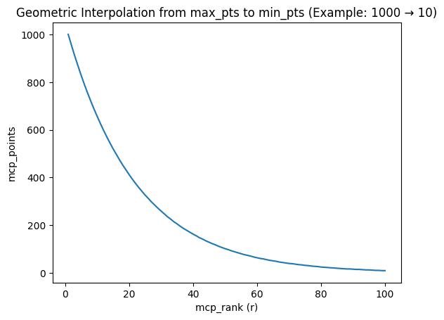

# MCP — Math Competition Points

## A Unified Ranking System for High School Math Competitors

---

## 1. Motivation

There is no single, comprehensive ranking of competitive math students in the United States. Students compete across a fragmented landscape — HMMT, PUMaC, AMO, ARML, BMT, MathCounts, and many more — but no system aggregates these results into a coherent picture of a student's competitive strength.

Professional tennis solved an analogous problem decades ago. The ATP (men's) and WTA (women's) ranking systems assign points based on tournament tier and finishing position, computed over a rolling window. This gives fans, coaches, and players a transparent, up-to-date measure of who is performing at the highest level.

**MCP (Math Competition Points)** adapts this model for competitive mathematics. By categorizing competitions into tiers, assigning points based on placement, and applying time decay, MCP produces a single number that reflects a student's recent, sustained performance across the most prestigious math competitions in the country.

### Why model after ATP / WTA?

- **Proven and intuitive.** The tiered tournament system is well-understood and has been successfully used in tennis for over 50 years.
- **Rewards breadth and consistency.** A student who performs well at multiple competitions is ranked higher than one with a single strong result — just as in tennis, a Grand Slam winner who skips other tournaments will be outranked by a player who consistently performs across all events.
- **Handles heterogeneous events.** Not all competitions are equally difficult or prestigious. The tier system naturally accounts for this without requiring score normalization across competitions with different formats and grading schemes.
- **Time-relevance.** The rolling window and decay function ensure that the ranking reflects current ability, not historical peak performance.

---

## 2. Competition Tiers

Competitions are classified into three tiers — **1000**, **500**, and **250** — based on difficulty, prestige, selectivity, and the caliber of the contestant pool. The tier number represents the maximum points awardable for a first-place finish.

### Tier 1000 — Premier Competitions

| Competition | Ranked Students | Notes |
|---|---|---|
| **HMMT February** | ~50 | Overall individual ranking. The most competitive invitational in the US. |
| **PUMaC Division A** | 30~45 | Overall individual ranking. Elite division of Princeton's competition. |
| **BMT Individual** | ~10 | Top overall individual at Berkeley Math Tournament. Only considers top scores. |
| **ARML Individual** | ~64 | Individual round ranking at the American Regions Math League. |
| **USAMO** | ~150 | USA Mathematical Olympiad. The pinnacle national olympiad. Awards only (no individual ranks). |

**Why these are Tier 1000:** These represent the most difficult and prestigious open competitions available to US high school students. HMMT February and PUMaC Division A draw the strongest fields in the country. USAMO is the national olympiad. ARML's individual round, while part of a team-oriented event, ranks students individually against the entire national field. BMT's top individual award recognizes the strongest performer at a major West Coast tournament with a strong field.

### Tier 500 — Major Competitions

| Competition | Ranked Students | Notes |
|---|---|---|
| **HMMT November** | ~50 | Overall individual ranking. |
| **PUMaC Division B** | ~36 | Overall individual ranking. |
| **USAJMO** | ~150 | USA Junior Mathematical Olympiad. Awards only (no individual ranks). |
| **CMIMC** | ~10 | Carnegie Mellon competition — overall individual. |
| **BAMO-12** | ~25 | Bay Area Mathematical Olympiad, high school division. |
| **MathCounts National** | ~56 | National ranking. **Special rules apply** (see Section 5). |
| **MPFG** | ~75 | Math Prize for Girls. **Counted toward MCP-W only** (see Section 6). |
| **MPFG-Olympiad** | ~32 | MPFG Olympiad round. **Counted toward MCP-W only** (see Section 6). |

**Why these are Tier 500:** These competitions are highly respected but either draw a somewhat less elite field than Tier 1000, or serve a specific sub-population. HMMT November is a strong competition but is explicitly positioned as a step below HMMT February. PUMaC Division B is the standard division below Division A. USAJMO targets students who qualify but not at the AMO level. CMIMC and BAMO-12 are strong regionals with competitive fields.

### Tier 250 — Competitive Regionals

| Competition | Ranked Students | Notes |
|---|---|---|
| **MMATHS** | ~99 | Yale's math competition. |
| **DMM** | ~50 | Duke Math Meet. |
| **CMM** | ~10 | Caltech Math Meet. |
| **BAMO-8** | ~30 | Bay Area Mathematical Olympiad, middle school division. |

**Why these are Tier 250:** These are well-run competitions with good problems but draw smaller or more geographically concentrated fields. They provide valuable competitive experience and meaningful results, but a strong finish here carries less weight than the same finish at a national-level event.

### Excluded Competitions

| Competition | Reason for Exclusion |
|---|---|
| **IMO** | International Mathematical Olympiad — only 6 US participants per year. |
| **EGMO** | European Girls' Mathematical Olympiad — only 4 US participants per year. |
| **RMM** | Romanian Masters of Mathematics — only ~6 US participants per year. |

**Why exclude these?** These are invitation-only international competitions with extremely limited US representation (4–6 students). Including them would amount to double-counting: the students who attend IMO, EGMO, or RMM have already earned significant MCP from the national competitions (AMO, JMO) that selected them. Adding 500 or 1000 more points for what is essentially a downstream honor would distort the rankings in favor of a handful of students who were already at the top. The selection for these teams is a recognition, not a separate open competition.

---

## 3. Point Distribution

Unlike tennis tournaments, where players are eliminated in discrete rounds (R32, R16, QF, SF, F), math competitions produce exact integer rankings. A student who finishes 5th performed measurably better than the student who finishes 6th, and their points should reflect that. Grouping ranks into tiers (as tennis does) would throw away this precision.

### Step 1: Normalize to `mcp_rank`

Before computing points, all results are normalized to a single numeric `mcp_rank` using the **average-rank-for-ties** method. This unifies rank-based and award-based competitions into a single system.

**For rank-based competitions** (HMMT, PUMaC, ARML, etc.): If multiple students share the same rank, their `mcp_rank` is the average of the positions they span. For example, if 3 students are tied at rank 5, they occupy positions 5, 6, 7, so `mcp_rank = (5+6+7)/3 = 6`.

**For award-based competitions** (USAMO, USAJMO, MPFG-Olympiad): Awards are mapped to positional blocks. For example, if USAMO 2025 has 20 Gold, 12 Silver, 55 Bronze, and 68 HM:
- Gold: positions 1–20 → `mcp_rank = 10.5`
- Silver: positions 21–32 → `mcp_rank = 26.5`
- Bronze: positions 33–87 → `mcp_rank = 60`
- HM: positions 88–155 → `mcp_rank = 121.5`

**For mixed-format competitions** (BAMO-12, BAMO-8): Numeric ranks come first, followed by Honorable Mention as a group.

**For MathCounts National**: Numeric ranks (1, 2) → Semi-finalists (S) → Quarter-finalists (Q) → Countdown 9–12 (C) → remaining numeric ranks (13+). Each code group is treated as a tied block.

### Step 2: Compute `mcp_points`

Every `mcp_rank` is converted to points via **geometric interpolation** between a maximum and a floor:

$$\text{mcp\_points}(r) = \text{round}\left(\text{max\_pts} \times \left(\frac{\text{min\_pts}}{\text{max\_pts}}\right)^{\frac{r-1}{N-1}}\right)$$

where:
- `r` = the student's `mcp_rank` (can be fractional for ties)
- `N` = total number of ranked students in that competition-year
- `max_pts` = `Tier × weight` (1000 for Tier 1000 overall, 500 for Tier 1000 subject tests at 50%)
- `min_pts` = `10 × weight` (10 for overall, 5 for subject tests at 50%)

This guarantees two anchor points:
- **Rank 1 always earns exactly `max_pts`.**
- **Rank N (last ranked) always earns exactly `min_pts`.**

Between these anchors, points decay by a **constant percentage per rank**, producing a smooth curve:

The decay rate adapts automatically to the field size:

$$\text{Decay ratio} = \left(\frac{\text{min\_pts}}{\text{max\_pts}}\right)^{\frac{1}{N-1}}$$

| Competition | Tier | N | Decay per rank |
|---|---|---|---|
| HMMT February | 1000 | 50 | −9.0% per rank |
| PUMaC Div A | 1000 | 44 | −10.2% per rank |
| ARML Individual | 1000 | 64 | −7.0% per rank |
| BMT Individual | 1000 | 10 | −40.1% per rank |
| HMMT November | 500 | 50 | −7.7% per rank |
| MathCounts National | 500 | 56 | −6.8% per rank |
| MMATHS | 250 | 99 | −3.2% per rank |

**Why geometric interpolation?**

- **Fixed endpoints.** Rank 1 = max_pts, Rank N = min_pts. No arbitrary tuning — the two anchor points fully determine the curve.
- **Self-adapting steepness.** Competitions with fewer ranked students (e.g. BMT with N=10) produce a steep curve — rank 2 already drops to 599. Competitions with many ranked students (e.g. MMATHS with N=99) produce a gentler curve. This is natural: in a small elite field, each rank gap is more meaningful.
- **Handles ties naturally.** Fractional `mcp_rank` values (from averaged ties) plug directly into the formula. Tied students earn identical points, and the points fall exactly where they should on the curve.
- **Unified formula.** The same formula handles rank-based, award-based, and mixed-format competitions. No separate award-to-points tables are needed.
- **Intuitive.** Each rank earns a fixed percentage less than the rank above it.

*Students not in the ranked list receive 0 points. A comprehensive worked example covering all rules is given in Section 8.*

---

## 4. Subject Tests and Sub-Events

Many competitions include both an overall individual ranking and separate subject-level rounds (e.g., HMMT February has Algebra & Number Theory, Combinatorics, and Geometry; PUMaC has Algebra, Geometry, Combinatorics, Number Theory; BMT has Algebra, Calculus, Discrete, Geometry; CMIMC has Algebra & NT, Combinatorics & CS, Geometry).

**Both overall and subject results count, at different weights:**

- The **overall individual ranking** counts at **100%** of the competition's tier value.
- Each **subject test** counts at **50%** of the competition's tier value.

Subject tests use the same unified formula from Section 3 with `weight = 0.5`:
- `max_pts = Tier × 0.5` (e.g. 500 for a Tier 1000 subject test)
- `min_pts = 10 × 0.5 = 5`

The `mcp_rank` column is pre-computed and stored in each subject test CSV, just like overall results. `mcp_points` is computed dynamically at build time.

### Competitions with Subject Tests

| Competition | Overall (Ranked) | Subject Tests (Ranked per subject) |
|---|---|---|
| HMMT February | `hmmt-feb` ~50 (100%) | Algebra & NT ~50, Combinatorics ~56, Geometry ~50 (50% each) |
| HMMT November | `hmmt-nov` ~50 (100%) | General ~82, Theme ~50 (50% each) |
| PUMaC Division A | `pumac` ~44 (100%) | Algebra ~30, Combinatorics ~31, Geometry ~32, Number Theory ~32 (50% each) |
| PUMaC Division B | `pumac-b` ~36 (100%) | Algebra ~34, Combinatorics ~31, Geometry ~51, Number Theory ~30 (50% each) |
| BMT | `bmt` ~10 (100%) | Algebra ~11, Calculus ~12, Discrete ~10, Geometry ~12 (50% each) |
| CMIMC | `cmimc` ~10 (100%) | Algebra & NT ~10, Combinatorics & CS ~10, Geometry ~10 (50% each) |

---

## 5. Time Decay and Rolling Window

### Rolling Window

MCP considers results from the **most recent 4 competition years**. Results older than 4 years are dropped entirely.

### Decay Schedule

More recent results carry greater weight. The decay follows a geometric halving:

| Recency | Weight |
|---|---|
| Current year (most recent) | 100% |
| 1 year prior | 50% |
| 2 years prior | 25% |
| 3 years prior | 12.5% |

**Formula:** For a result earned `y` years ago (where `y = 0` is the current year):

$$\text{Effective Points} = \text{Raw Points} \times \left(\frac{1}{2}\right)^y$$

### Why geometric decay?

- **Smooth and predictable.** Each year's weight is exactly half the previous year's, making the system easy to understand and compute.
- **Reflects improvement trajectories.** Competitive math students improve rapidly. A student who scored well as a sophomore but is now a senior should be judged primarily on recent performance.
- **Avoids cliff effects.** Unlike a hard cutoff (e.g., "only last 2 years count"), geometric decay ensures that older results fade gradually rather than vanishing overnight.
- **Mirrors ATP/WTA philosophy.** Tennis rankings use a rolling 52-week window with full weight, but the principle of recency-weighting is the same.

---

## 6. Special Rules

### 6a. MathCounts National — No Time Limit, Equal Weight

MathCounts National is classified as a **Tier 500** competition with special treatment:

- **No rolling window.** All historical MathCounts National results are counted, regardless of age.
- **Equal weight across all years.** No time decay is applied. A 1st-place finish in 2019 earns the same points as a 1st-place finish in 2025.

**Why?**

MathCounts is a middle school competition (grades 6–8). Students compete in it during a narrow window of their mathematical development and cannot return to it later. Unlike high school competitions, where a student can compete at HMMT for 4 consecutive years, MathCounts results are inherently limited to a student's middle school years.

Applying time decay would systematically disadvantage older students who performed well at MathCounts years ago — even though their MathCounts achievement remains a meaningful signal of mathematical talent. In tennis terms, MathCounts is like a junior Grand Slam: the result stands on its own merits regardless of when it occurred.

Additionally, strong MathCounts performers who transition into high school competitions benefit from having their earlier accomplishments reflected in their MCP. This creates a more complete picture of a student's mathematical trajectory.

### 6b. MPFG and MCP-W — Separate Women's Ranking

The **Math Prize for Girls (MPFG)** and **MPFG-Olympiad** are Tier 500 competitions open only to girls. Points from these competitions are **not** included in the overall MCP ranking. Instead, they contribute to a separate **MCP-W (MCP for Women)** ranking.

**MCP-W is calculated as follows:**
- Take the student's full MCP score (from all open competitions).
- Add points earned from MPFG and MPFG-Olympiad (subject to the standard 4-year rolling window and decay).
- The sum is the student's MCP-W score.

**Why a separate ranking?**

- **Fairness.** MPFG and MPFG-Olympiad are restricted to female participants. Including these points in the overall MCP would create opportunities unavailable to male students, distorting the ranking. In tennis, the ATP and WTA maintain separate rankings for the same reason.
- **Visibility.** A dedicated MCP-W ranking highlights the achievements of female math competitors. Women are significantly underrepresented in competitive mathematics, and a visible ranking system can help recognize and encourage participation.
- **No penalty.** Female students are not penalized — they receive full MCP from all open competitions. MCP-W is purely additive: it can only increase (or equal) their overall MCP.
- **Analogous to WTA.** Just as the WTA rankings exist alongside the ATP rankings, MCP-W exists alongside MCP, serving the same purpose of recognition and motivation.

---

## 7. Aggregation and Final Score

A student's **MCP** is the sum of their effective (decay-weighted) points across all eligible competitions:

$$\text{MCP} = \sum_{c \in \text{competitions}} \sum_{y=0}^{3} \text{mcp\_points}(c, y) \times \left(\frac{1}{2}\right)^y$$

with the exception of MathCounts, which uses:

$$\text{MCP}_{\text{MathCounts}} = \sum_{y \in \text{all years}} \text{mcp\_points}(\text{MathCounts}, y) \times 1.0$$

There is **no cap** on the number of competitions counted. A student who competes broadly and performs well everywhere will be rewarded, just as in tennis.

Only `mcp_rank` is stored in the competition CSV files. `mcp_points` is computed dynamically at build time using each competition's tier, weight, and the geometric interpolation formula. The final output includes:

- **Per-record `mcp_points`**: each competition result carries its computed points.
- **Per-student `mcp`**: the sum of all decay-weighted points from open competitions.
- **Per-student `mcp_w`** (female students only): `mcp` + decay-weighted MPFG/MPFG-Olympiad points.

### MCP-W (for female students)

$$\text{MCP-W} = \text{MCP} + \sum_{c \in \{\text{MPFG, MPFG-Olympiad}\}} \sum_{y=0}^{3} \text{mcp\_points}(c, y) \times \left(\frac{1}{2}\right)^y$$

---

## 8. Worked Example: HMMT February over 4 Years

Consider a student who competed at HMMT February (Tier 1000) from 2023 to 2026, steadily improving. The overall individual ranking has ~50 students (N=50), and each of the three subject tests (Algebra & NT, Combinatorics, Geometry) counts at 50% weight (max 500, min 5).

**Points per event in the current year (2026):**

| Event | Weight | Rank | mcp_points |
|---|---|---|---|
| Overall | 100% | 3 | 829 |
| Algebra & NT | 50% | 5 | 343 |
| Combinatorics | 50% | 10 | 215 |
| Geometry | 50% | 2 | 455 |

**All 4 years with time decay:**

| Year | Overall | Alg & NT | Combo | Geometry | Raw Total | Decay | Effective |
|---|---|---|---|---|---|---|---|
| 2026 | 829 (rank 3) | 343 (rank 5) | 215 (rank 10) | 455 (rank 2) | 1842 | 100% | 1842.00 |
| 2025 | 518 (rank 8) | 215 (rank 10) | 134 (rank 15) | 343 (rank 5) | 1210 | 50% | 605.00 |
| 2024 | 268 (rank 15) | 134 (rank 15) | 84 (rank 20) | 215 (rank 10) | 701 | 25% | 175.25 |
| 2023 | 105 (rank 25) | 84 (rank 20) | 33 (rank 30) | 134 (rank 15) | 356 | 12.5% | 44.50 |
| **Total** | | | | | | | **2666.75** |

This student's MCP contribution from HMMT February alone is **2666.75**. Their full MCP score would also include decay-weighted points from any other competitions they entered (ARML, PUMaC, AMO, etc.) within the 4-year window.

---

## 9. Competition Configuration

All MCP parameters are centralized in a single configuration file. Each competition defines its tier, weight, ranking mode (how raw data is converted to `mcp_rank`), and which CSV column holds the raw ranking data. Competitions without MCP fields (IMO, EGMO, RMM) are excluded from point calculations.

Result files are discovered dynamically — all result CSVs within each competition-year directory are processed.

| Competition | Tier | Weight | Mode |
|---|---|---|---|
| HMMT February (overall) | 1000 | 100% | rank |
| HMMT Feb — Algebra & NT | 1000 | 50% | rank |
| HMMT Feb — Combinatorics | 1000 | 50% | rank |
| HMMT Feb — Geometry | 1000 | 50% | rank |
| PUMaC Division A (overall) | 1000 | 100% | rank |
| PUMaC A — Algebra | 1000 | 50% | rank |
| PUMaC A — Combinatorics | 1000 | 50% | rank |
| PUMaC A — Geometry | 1000 | 50% | rank |
| PUMaC A — Number Theory | 1000 | 50% | rank |
| BMT Individual (overall) | 1000 | 100% | rank |
| BMT — Algebra | 1000 | 50% | rank |
| BMT — Calculus | 1000 | 50% | rank |
| BMT — Discrete | 1000 | 50% | rank |
| BMT — Geometry | 1000 | 50% | rank |
| ARML Individual | 1000 | 100% | rank |
| USAMO | 1000 | 100% | award |
| HMMT November (overall) | 500 | 100% | rank |
| HMMT Nov — General | 500 | 50% | rank |
| HMMT Nov — Theme | 500 | 50% | rank |
| PUMaC Division B (overall) | 500 | 100% | rank |
| PUMaC B — Algebra | 500 | 50% | rank |
| PUMaC B — Combinatorics | 500 | 50% | rank |
| PUMaC B — Geometry | 500 | 50% | rank |
| PUMaC B — Number Theory | 500 | 50% | rank |
| USAJMO | 500 | 100% | award |
| CMIMC (overall) | 500 | 100% | rank |
| CMIMC — Algebra & NT | 500 | 50% | rank |
| CMIMC — Combinatorics & CS | 500 | 50% | rank |
| CMIMC — Geometry | 500 | 50% | rank |
| BAMO-12 | 500 | 100% | rank_mixed |
| MathCounts National | 500 | 100% | mathcounts |
| MPFG (→ MCP-W) | 500 | 100% | rank |
| MPFG-Olympiad (→ MCP-W) | 500 | 100% | award |
| MMATHS | 250 | 100% | rank |
| DMM | 250 | 100% | rank |
| CMM | 250 | 100% | rank |
| BAMO-8 | 250 | 100% | rank_mixed |

---

## 10. Data Pipeline

MCP computation is a two-stage pipeline:

### Stage 1: Compute `mcp_rank`

All result CSVs are processed using the competition configuration. For each file, the raw ranking column is read and the appropriate ranking mode is applied:

- **`rank`**: numeric ranks with average-rank-for-ties.
- **`award`**: award strings (Gold, Silver, Bronze, HM) mapped to positional blocks.
- **`rank_mixed`**: numeric ranks followed by Honorable Mention as a tied group.
- **`mathcounts`**: numeric ranks + special codes (S, Q, C) treated as tied blocks.

The computed `mcp_rank` column is written back into the CSV.

### Stage 2: Compute `mcp_points` and aggregate

At build time, the system:

1. Loads each competition's tier and weight from the configuration.
2. For each result file, counts N (students with `mcp_rank`) and computes `mcp_points` per record using geometric interpolation.
3. Aggregates per-student totals:
   - **`mcp`**: sum of decay-weighted points from all open competitions.
   - **`mcp_w`**: `mcp` + decay-weighted MPFG/MPFG-Olympiad points (only present for students with MPFG results).
4. The current year is determined automatically from the data (max year found).

### Adding a new competition

1. Add the competition to the configuration with its tier, weight, ranking mode, and rank column.
2. Place result CSVs in the appropriate competition-year directory.
3. Run both stages in order.

---

## 11. Summary

| Design Decision | Choice | Rationale |
|---|---|---|
| Tier system | 1000 / 500 / 250 | Matches competition prestige and field strength |
| Point formula | Tier × (10/Tier)^((r−1)/(N−1)) | Rank 1 = Tier, Rank N = 10; geometric decay adapts to field size |
| Rolling window | 4 years | Captures a full high school career |
| Time decay | Geometric (÷2 per year) | Smooth, recency-biased, no cliff effects |
| IMO/EGMO/RMM | Excluded | Too few participants; double-counts national selections |
| MathCounts | No decay, no window | Middle school results are inherently time-limited |
| MPFG | Separate MCP-W | Fairness (gender-restricted); visibility for women |
| Subject tests | 50% of tier value | Rewards specialization without over-counting |

MCP provides a transparent, principled, and computable ranking of competitive math students — inspired by a system that has worked for professional tennis for decades.
