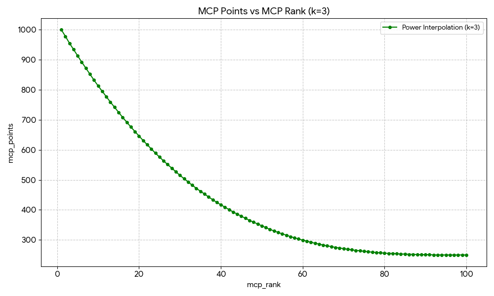

# MCP — Math Competition Points

## A Unified Ranking System for High School Math Competitors

- [1. Motivation](#1-motivation)
- [2. Competition Tiers](#2-competition-tiers)
- [3. Point Distribution](#3-point-distribution)
- [4. Subject Tests and Sub-Events](#4-subject-tests-and-sub-events)
- [5. Time Decay and Rolling Window](#5-time-decay-and-rolling-window)
- [6. Special Rules](#6-special-rules)
- [7. Aggregation and Final Score](#7-aggregation-and-final-score)
- [8. Worked Example: HMMT February over 4 Years](#8-worked-example-hmmt-february-over-4-years)
- [9. Competition Configuration](#9-competition-configuration)
- [10. Data Pipeline](#10-data-pipeline)
- [11. MCP %](#11-mcp-)
- [12. Limitations](#12-limitations)
- [13. Summary](#13-summary)
- [Disclaimer](#disclaimer)

---

## 1. Motivation

There is no single, comprehensive ranking of competitive math students in the United States. Students compete across a fragmented landscape — HMMT, PUMaC, AMO, ARML, BMT, MathCounts, and many more — but no system aggregates these results into a coherent picture of a student's competitive strength.

Professional tennis solved an analogous problem decades ago. The ATP (men's) and WTA (women's) ranking systems assign points based on tournament tier and finishing position, computed over a rolling window. This gives fans, coaches, and players a transparent, up-to-date measure of who is performing at the highest level.

**MCP (Math Competition Points)** adapts this model for competitive mathematics. By categorizing competitions into tiers, assigning points based on placement, and applying time decay, MCP produces a single number that reflects a student's recent, sustained performance across the most prestigious math competitions in the country.

### Why model after ATP / WTA?

- **Proven and intuitive.** The tiered tournament system is well-understood and has been successfully used in tennis for over 50 years.
- **Rewards breadth and consistency.** A student who performs well at multiple competitions is ranked higher than one with a single strong result — just as in tennis, a Grand Slam winner who skips other tournaments will be outranked by a player who consistently performs across all events.
- **Handles heterogeneous events.** Not all competitions are equally difficult or prestigious. The tier system naturally accounts for this without requiring score normalization across competitions with different formats and grading schemes.
- **Time-relevance.** The rolling window and decay function ensure that the ranking reflects current ability, not historical peak performance.

---

## 2. Competition Tiers

Competitions are classified into four tiers — **2000**, **1000**, **500**, and **250** — based on difficulty, prestige, selectivity, and the caliber of the contestant pool. The tier number represents the maximum points awardable for a first-place finish.

### Tier 2000 — Grand Slam

| Competition | Ranked Students | Notes |
|---|---|---|
| **IMO** | 6 | International Mathematical Olympiad — US team only. |
| **EGMO** | 4 | European Girls' Mathematical Olympiad — US team only. **Counted toward MCP-W only** (see Section 6). |
| **RMM** | ~6 | Romanian Masters of Mathematics — US participants only. |

**Why Grand Slam?** These are the pinnacle international olympiads. Participation is invitation-only and extremely selective — students earn their spot through national competitions (AMO, JMO). A first-place finish among US participants at IMO, EGMO, or RMM represents the highest achievement in competitive mathematics and warrants the maximum MCP value (2000 points).

### Tier 1000 — Premier Competitions

| Competition | Ranked Students | Notes |
|---|---|---|
| **HMMT February** | ~50 | Overall individual and subject (Algebra & NT, Combinatorics, Geometry) rankings. The most competitive invitational in the US. |
| **PUMaC Division A** | 30~45 | Overall individual and subject (Algebra, Combinatorics, Geometry, Number Theory) rankings. Elite division of Princeton's competition. |
| **BMT Individual** | ~10 | Overall individual and subject (Algebra, Calculus, Discrete, Geometry) rankings at Berkeley Math Tournament. Only considers top scores. |
| **ARML Individual** | ~64 | Individual round ranking at the American Regions Math League. |
| **USAMO** | ~150 | USA Mathematical Olympiad. The pinnacle national olympiad. Awards only (no individual ranks). |

**Why these are Tier 1000:** These represent the most difficult and prestigious open competitions available to US high school students. HMMT February and PUMaC Division A draw the strongest fields in the country. USAMO is the national olympiad. ARML's individual round, while part of a team-oriented event, ranks students individually against the entire national field. BMT's top individual award recognizes the strongest performer at a major West Coast tournament with a strong field. We would like to include SMT (Stanford Math Tournament) in this tier, but SMT does not publish results. (SMT, talk to us 🙂)

### Tier 500 — Major Competitions

| Competition | Ranked Students | Notes |
|---|---|---|
| **HMMT November** | ~50 | Overall individual and subject (General, Theme) rankings. |
| **PUMaC Division B** | ~36 | Overall individual and subject (Algebra, Combinatorics, Geometry, Number Theory) rankings. |
| **USAJMO** | ~150 | USA Junior Mathematical Olympiad. Awards only (no individual ranks). |
| **CMIMC** | ~10 | Carnegie Mellon competition — overall individual and subject (Algebra & NT, Combinatorics & CS, Geometry) rankings. |
| **BAMO-12** | ~25 | Bay Area Mathematical Olympiad, high school division. |
| **MathCounts National** | ~56 | National ranking. **Special rules apply** (see Section 5). |
| **MPFG** | ~75 | Math Prize for Girls. **Counted toward MCP-W only** (see Section 6). |
| **MPFG-Olympiad** | ~32 | MPFG Olympiad round. **Counted toward MCP-W only** (see Section 6). |

**Why these are Tier 500:** These competitions are highly respected but either draw a somewhat less elite field than Tier 1000, or serve a specific sub-population. HMMT November is a strong competition but is explicitly positioned as a step below HMMT February. PUMaC Division B is the standard division below Division A. USAJMO targets students who qualify but not at the AMO level. CMIMC and BAMO-12 are strong regionals with competitive fields.

### Tier 250 — Competitive Regionals

| Competition | Ranked Students | Notes |
|---|---|---|
| **MMATHS** | ~99 | Yale's math competition. |
| **DMM** | ~50 | Duke Math Meet. |
| **CMM** | ~10 | Caltech Math Meet. |
| **BAMO-8** | ~30 | Bay Area Mathematical Olympiad, middle school division. |

**Why these are Tier 250:** These are well-run competitions with good problems but draw smaller or more geographically concentrated fields. They provide valuable competitive experience and meaningful results, but a strong finish here carries less weight than the same finish at a national-level event.

---

## 3. Point Distribution

Unlike tennis tournaments, where players are eliminated in discrete rounds (R32, R16, QF, SF, F), math competitions produce exact integer rankings. A student who finishes 5th performed measurably better than the student who finishes 6th, and their points should reflect that. Grouping ranks into tiers (as tennis does) would throw away this precision.

### Step 1: Normalize to `mcp_rank`

Before computing points, all results are normalized to a single numeric `mcp_rank` using the **average-rank-for-ties** method. This unifies rank-based and award-based competitions into a single system.

**For rank-based competitions** (HMMT, PUMaC, ARML, etc.): If multiple students share the same rank, their `mcp_rank` is the average of the positions they span. For example, if 3 students are tied at rank 5, they occupy positions 5, 6, 7, so `mcp_rank = (5+6+7)/3 = 6`.

**For award-based competitions** (USAMO, USAJMO, MPFG-Olympiad): Awards are mapped to positional blocks. For example, if USAMO 2025 has 20 Gold, 12 Silver, 55 Bronze, and 68 HM:
- Gold: positions 1–20 → `mcp_rank = 10.5`
- Silver: positions 21–32 → `mcp_rank = 26.5`
- Bronze: positions 33–87 → `mcp_rank = 60`
- HM: positions 88–155 → `mcp_rank = 121.5`

**For mixed-format competitions** (BAMO-12, BAMO-8): Numeric ranks come first, followed by Honorable Mention as a group.

**For MathCounts National**: Numeric ranks (1, 2) → Semi-finalists (S) → Quarter-finalists (Q) → Countdown 9–12 (C) → remaining numeric ranks (13+). Each code group is treated as a tied block.

### Step 2: Compute `mcp_points`

**Grand Slam competitions (IMO, EGMO, RMM):** Because these competitions are so selective, points are awarded by **medal** rather than by rank interpolation. No power-law curve is used.
- **Gold:** full tier value (2000)
- **Silver:** tier value × 75% (1500)
- **Bronze:** tier value × 50% (1000)

The standard time-decay rule (Section 5) still applies.

**All other competitions:** Every `mcp_rank` is converted to points via a **power-law curve** between a maximum and a floor:

$$\text{mcp}\_\text{points}(r) = \text{round}\left(\text{min}\_\text{pts} + (\text{max}\_\text{pts} - \text{min}\_\text{pts}) \times \left(\frac{N - r}{N - 1}\right)^k\right)$$

| Variable | Description | Example Value |
|---|---|---|
| `r` | The current rank being calculated | 1 … 100 |
| `max_pts` | The maximum points awarded (at Rank 1) | 1000 |
| `min_pts` | The floor/minimum points awarded (at Rank N) | 500 |
| `N` | The total number of ranked students | 100 |
| `k` | The steepness coefficient | 3 |

The derived values are:
- `max_pts` = `Tier × weight` (1000 for Tier 1000 overall, 500 for Tier 1000 subject tests at 50%)
- `min_pts` = `Tier × 0.5 × weight` (500 for Tier 1000 overall, 250 for Tier 1000 subject tests at 50%)

This guarantees two anchor points:
- **Rank 1 always earns exactly `max_pts`.**
- **Rank N (last ranked) always earns exactly `min_pts`.**

Between these anchors, the steepness coefficient $k$ controls how quickly points drop off. With $k = 3$, the curve is convex — top ranks are separated by large point gaps while lower ranks are compressed together near the floor:

Try the formula interactively: [Desmos calculator](https://www.desmos.com/calculator/amsujwhxit).

**Why this formula?**

- **Fixed endpoints.** Rank 1 = max_pts, Rank N = min_pts. The two anchor points are always respected regardless of field size.
- **Tunable steepness.** The exponent $k$ controls how much the curve rewards top finishers. Higher $k$ concentrates more points at the top. With $k = 3$, the top ~20% of finishers earn the majority of the point spread while lower ranks converge toward the floor.
- **Self-adapting to field size.** The same formula and $k$ value work across competitions with 10 or 100 ranked students. The fraction $(N - r)/(N - 1)$ normalizes rank position to a 0–1 scale.
- **Handles ties naturally.** Fractional `mcp_rank` values (from averaged ties) plug directly into the formula. Tied students earn identical points.
- **Unified formula.** The same formula handles rank-based, award-based, and mixed-format competitions. No separate award-to-points tables are needed.

*Students not in the ranked list receive 0 points. A comprehensive worked example covering all rules is given in Section 8.*

---

## 4. Subject Tests and Sub-Events

Many competitions include both an overall individual ranking and separate subject-level rounds (e.g., HMMT February has Algebra & Number Theory, Combinatorics, and Geometry; PUMaC has Algebra, Geometry, Combinatorics, Number Theory; BMT has Algebra, Calculus, Discrete, Geometry; CMIMC has Algebra & NT, Combinatorics & CS, Geometry).

**Both overall and subject results count, at different weights:**

- The **overall individual ranking** counts at **100%** of the competition's tier value.
- Each **subject test** counts at **50%** of the competition's tier value.

Subject tests use the same unified formula from Section 3 with `weight = 0.5`:
- `max_pts = Tier × 0.5` (e.g. 500 for a Tier 1000 subject test)
- `min_pts = Tier × 0.5 × 0.5` (e.g. 250 for a Tier 1000 subject test)

The `mcp_rank` column is pre-computed and stored in each subject test CSV, just like overall results. `mcp_points` is computed dynamically at build time.

### Competitions with Subject Tests

| Competition | Overall (Ranked) | Subject Tests (Ranked per subject) |
|---|---|---|
| HMMT February | `hmmt-feb` ~50 (100%) | Algebra & NT ~50, Combinatorics ~56, Geometry ~50 (50% each) |
| HMMT November | `hmmt-nov` ~50 (100%) | General ~82, Theme ~50 (50% each) |
| PUMaC Division A | `pumac` ~44 (100%) | Algebra ~30, Combinatorics ~31, Geometry ~32, Number Theory ~32 (50% each) |
| PUMaC Division B | `pumac-b` ~36 (100%) | Algebra ~34, Combinatorics ~31, Geometry ~51, Number Theory ~30 (50% each) |
| BMT | `bmt` ~10 (100%) | Algebra ~11, Calculus ~12, Discrete ~10, Geometry ~12 (50% each) |
| CMIMC | `cmimc` ~10 (100%) | Algebra & NT ~10, Combinatorics & CS ~10, Geometry ~10 (50% each) |

---

## 5. Time Decay and Rolling Window

### Rolling Window

MCP considers results from the **most recent 4 competition years**. Results older than 4 years are dropped entirely.

### Decay Schedule

More recent results carry greater weight. The decay follows a geometric halving:

| Recency | Weight |
|---|---|
| Current year (most recent) | 100% |
| 1 year prior | 50% |
| 2 years prior | 25% |
| 3 years prior | 12.5% |

**Formula:** For a result earned `y` years ago (where `y = 0` is the current year):

$$\text{Effective Points} = \text{Raw Points} \times \left(\frac{1}{2}\right)^y$$

### Why geometric decay?

- **Smooth and predictable.** Each year's weight is exactly half the previous year's, making the system easy to understand and compute.
- **Reflects improvement trajectories.** Competitive math students improve rapidly. A student who scored well as a sophomore but is now a senior should be judged primarily on recent performance.
- **Avoids cliff effects.** Unlike a hard cutoff (e.g., "only last 2 years count"), geometric decay ensures that older results fade gradually rather than vanishing overnight.
- **Mirrors ATP/WTA philosophy.** Tennis rankings use a rolling 52-week window with full weight, but the principle of recency-weighting is the same.

---

## 6. Special Rules

### 6a. MathCounts National — No Time Limit, Equal Weight

MathCounts National is classified as a **Tier 500** competition with special treatment:

- **No rolling window.** All historical MathCounts National results are counted, regardless of age.
- **Equal weight across all years.** No time decay is applied. A 1st-place finish in 2019 earns the same points as a 1st-place finish in 2025.

**Why?**

MathCounts is a middle school competition (grades 6–8). Students compete in it during a narrow window of their mathematical development and cannot return to it later. Unlike high school competitions, where a student can compete at HMMT for 4 consecutive years, MathCounts results are inherently limited to a student's middle school years.

Applying time decay would systematically disadvantage older students who performed well at MathCounts years ago — even though their MathCounts achievement remains a meaningful signal of mathematical talent. In tennis terms, MathCounts is like a junior Grand Slam: the result stands on its own merits regardless of when it occurred.

Additionally, strong MathCounts performers who transition into high school competitions benefit from having their earlier accomplishments reflected in their MCP. This creates a more complete picture of a student's mathematical trajectory.

### 6b. MPFG and MCP-W — Separate Women's Ranking

The **Math Prize for Girls (MPFG)**, **MPFG-Olympiad**, and **EGMO** are competitions open only to girls. Points from these competitions are **not** included in the overall MCP ranking. Instead, they contribute to a separate **MCP-W (MCP for Women)** ranking.

**MCP-W is calculated as follows:**
- Take the student's full MCP score (from all open competitions).
- Add points earned from MPFG, MPFG-Olympiad, and EGMO (subject to the standard 4-year rolling window and decay).
- The sum is the student's MCP-W score.

**Why a separate ranking?**

- **Fairness.** MPFG, MPFG-Olympiad, and EGMO are restricted to female participants. Including these points in the overall MCP would create opportunities unavailable to male students, distorting the ranking. In tennis, the ATP and WTA maintain separate rankings for the same reason.
- **Visibility.** A dedicated MCP-W ranking highlights the achievements of female math competitors. Women are significantly underrepresented in competitive mathematics, and a visible ranking system can help recognize and encourage participation.
- **No penalty.** Female students are not penalized — they receive full MCP from all open competitions. MCP-W is purely additive: it can only increase (or equal) their overall MCP.
- **Analogous to WTA.** Just as the WTA rankings exist alongside the ATP rankings, MCP-W exists alongside MCP, serving the same purpose of recognition and motivation.

---

## 7. Aggregation and Final Score

A student's **MCP** is the sum of their effective (decay-weighted) points across all eligible competitions:

$$\text{MCP} = \sum_{c \in \text{competitions}} \sum_{y=0}^{3} \text{mcp}\_\text{points}(c, y) \times \left(\frac{1}{2}\right)^y$$

with the exception of MathCounts, which uses:

$$\text{MCP}\_{\text{MathCounts}} = \sum_{y \in \text{all years}} \text{mcp}\_\text{points}(\text{MathCounts}, y) \times 1.0$$

There is **no cap** on the number of competitions counted. A student who competes broadly and performs well everywhere will be rewarded, just as in tennis.

Only `mcp_rank` is stored in the competition CSV files. `mcp_points` and `mcp_contrib` are computed dynamically at build time using each competition's tier, weight, and the geometric interpolation formula. The final output includes:

- **Per-record `mcp_points`**: the raw points earned for that result (before time decay).
- **Per-record `mcp_contrib`**: the time-weighted points this result contributes to the student's total MCP. Computed as `mcp_points × decay_weight`. Only present when positive.
- **Per-student `mcp`**: the sum of all `mcp_contrib` values from open competitions.
- **Per-student `mcp_w`** (all female students): `mcp` + decay-weighted MPFG/MPFG-Olympiad/EGMO points. Present for every female student, even those without MPFG or EGMO results (in which case `mcp_w` equals `mcp`).

### MCP-W (for female students)

$$\text{MCP-W} = \text{MCP} + \sum_{c \in \lbrace\text{MPFG, MPFG-Olympiad, EGMO}\rbrace} \sum_{y=0}^{3} \text{mcp}\_\text{points}(c, y) \times \left(\frac{1}{2}\right)^y$$

---

## 8. Worked Example: HMMT February over 4 Years

Consider a student who competed at HMMT February (Tier 1000) from 2023 to 2026, steadily improving. The overall individual ranking has ~50 students (N=50), and each of the three subject tests (Algebra & NT, Combinatorics, Geometry) counts at 50% weight (max 500, min 250).

**Points per event in the current year (2026):**

| Event | Weight | Rank | mcp_points |
|---|---|---|---|
| Overall | 100% | 3 | 941 |
| Algebra & NT | 50% | 5 | 444 |
| Combinatorics | 50% | 10 | 386 |
| Geometry | 50% | 2 | 485 |

**All 4 years with time decay:**

| Year | Overall | Alg & NT | Combo | Geometry | Raw Total | Decay | Effective |
|---|---|---|---|---|---|---|---|
| 2026 | 941 (rank 3) | 444 (rank 5) | 386 (rank 10) | 485 (rank 2) | 2256 | 100% | 2256.00 |
| 2025 | 815 (rank 8) | 386 (rank 10) | 341 (rank 15) | 444 (rank 5) | 1986 | 50% | 993.00 |
| 2024 | 682 (rank 15) | 341 (rank 15) | 307 (rank 20) | 386 (rank 10) | 1716 | 25% | 429.00 |
| 2023 | 566 (rank 25) | 307 (rank 20) | 267 (rank 30) | 341 (rank 15) | 1481 | 12.5% | 185.13 |
| **Total** | | | | | | | **3863.13** |

This student's MCP contribution from HMMT February alone is **3863.13**. Their full MCP score would also include decay-weighted points from any other competitions they entered (ARML, PUMaC, AMO, etc.) within the 4-year window.

---

## 9. Competition Configuration

All MCP parameters are centralized in a single configuration file. Each competition defines its tier, weight, ranking mode (how raw data is converted to `mcp_rank`), and which CSV column holds the raw ranking data.

Result files are discovered dynamically — all result CSVs within each competition-year directory are processed.

| Competition | Tier | Weight | Mode |
|---|---|---|---|
| IMO | 2000 | 100% | rank |
| EGMO (→ MCP-W) | 2000 | 100% | rank |
| RMM | 2000 | 100% | rank |
| HMMT February (overall) | 1000 | 100% | rank |
| HMMT Feb — Algebra & NT | 1000 | 50% | rank |
| HMMT Feb — Combinatorics | 1000 | 50% | rank |
| HMMT Feb — Geometry | 1000 | 50% | rank |
| PUMaC Division A (overall) | 1000 | 100% | rank |
| PUMaC A — Algebra | 1000 | 50% | rank |
| PUMaC A — Combinatorics | 1000 | 50% | rank |
| PUMaC A — Geometry | 1000 | 50% | rank |
| PUMaC A — Number Theory | 1000 | 50% | rank |
| BMT Individual (overall) | 1000 | 100% | rank |
| BMT — Algebra | 1000 | 50% | rank |
| BMT — Calculus | 1000 | 50% | rank |
| BMT — Discrete | 1000 | 50% | rank |
| BMT — Geometry | 1000 | 50% | rank |
| ARML Individual | 1000 | 100% | rank |
| USAMO | 1000 | 100% | award |
| HMMT November (overall) | 500 | 100% | rank |
| HMMT Nov — General | 500 | 50% | rank |
| HMMT Nov — Theme | 500 | 50% | rank |
| PUMaC Division B (overall) | 500 | 100% | rank |
| PUMaC B — Algebra | 500 | 50% | rank |
| PUMaC B — Combinatorics | 500 | 50% | rank |
| PUMaC B — Geometry | 500 | 50% | rank |
| PUMaC B — Number Theory | 500 | 50% | rank |
| USAJMO | 500 | 100% | award |
| CMIMC (overall) | 500 | 100% | rank |
| CMIMC — Algebra & NT | 500 | 50% | rank |
| CMIMC — Combinatorics & CS | 500 | 50% | rank |
| CMIMC — Geometry | 500 | 50% | rank |
| BAMO-12 | 500 | 100% | rank_mixed |
| MathCounts National | 500 | 100% | rank |
| MPFG (→ MCP-W) | 500 | 100% | rank |
| MPFG-Olympiad (→ MCP-W) | 500 | 100% | award |
| MMATHS | 250 | 100% | rank |
| DMM | 250 | 100% | rank |
| CMM | 250 | 100% | rank |
| BAMO-8 | 250 | 100% | rank_mixed |

---

## 10. Data Pipeline

MCP computation is a two-stage pipeline:

### Stage 1: Compute `mcp_rank`

All result CSVs are processed using the competition configuration. For each file, the raw ranking column is read and the appropriate ranking mode is applied:

- **`rank`**: numeric ranks with average-rank-for-ties.
- **`award`**: award strings (Gold, Silver, Bronze, HM) mapped to positional blocks.
- **`rank_mixed`**: numeric ranks followed by Honorable Mention as a tied group.
- **`mathcounts`**: numeric ranks + special codes (S, Q, C) treated as tied blocks.

The computed `mcp_rank` column is written back into the CSV.

### Stage 2: Compute `mcp_points` and aggregate

At build time, the system:

1. Loads each competition's tier and weight from the configuration.
2. For each result file, counts N (students with `mcp_rank`) and computes `mcp_points` per record. Grand Slam competitions (IMO, EGMO, RMM) use award-based points (Gold/Silver/Bronze); all others use geometric interpolation.
3. Determines the current year **per contest** from the data (the most recent year with results for that contest). Time decay is applied relative to each contest's own current year, not a single global year. This ensures that a contest whose latest data is from 2025 treats 2025 as 100% weight, even if other contests have 2026 data.
4. Aggregates per-student totals:
   - **`mcp`**: sum of decay-weighted points from all open competitions.
   - **`mcp_w`**: `mcp` + decay-weighted MPFG/MPFG-Olympiad/EGMO points. Present for all female students.

### Adding a new competition

1. Add the competition to the configuration with its tier, weight, ranking mode, and rank column.
2. Place result CSVs in the appropriate competition-year directory.
3. Run both stages in order.

---

## 11. MCP %

**MCP %** (MCP contribution percentage) measures what fraction of a student's total MCP comes from a selected set of competitions. It answers the question: *"How much of this student's ranking is driven by contest X (or contests X, Y, Z)?"*

### What it means

When you select one or more contests in the database's contest filter (e.g., AMO, HMMT February, or both), MCP % shows the ratio:

$$\text{MCP \%} = \frac{\text{MCP from selected contests}}{\text{Total MCP}}$$

For example, if a student has 2000 total MCP and 1200 of it comes from AMO and USAMO, their MCP % for that selection is 60%. A student whose MCP is entirely from HMMT would show 100% when HMMT is selected and 0% when only AMO is selected.

### How to use it

- **Identify specialization.** Students with high MCP % for a given contest are heavily "specialists" in that competition — their ranking is driven largely by that event. Students with low MCP % for the same contest have diversified their results across many competitions.
- **Compare contest importance.** Select different contest combinations to see how much each contributes to top students' totals. This helps understand which competitions drive the overall ranking.
- **Sort and explore.** The database lets you sort by MCP % (ascending or descending) when a contest filter is active. Use this to find students whose MCP is most (or least) concentrated in the selected contests.

MCP % is only meaningful when the contest filter is active. Without a filter, there is no "selected" subset, so MCP % is not computed.

---

## 12. Limitations

Our data covers only students who received **official recognition** at each competition — i.e., those who placed in the ranked list or received an award (Gold, Silver, Bronze, Honorable Mention, etc.). We do not have complete results for all competitors at most events.

Because of this, we set **`min_pts` to 50% of `max_pts`** in the point distribution formula (Section 3). The last-ranked student in our data (Rank N) earns `min_pts`, but in reality they may have outperformed many other competitors who are not in our dataset. A higher floor (50% of max) reduces the penalty for being "last" in a partially observed field.

**If we had complete data** — full results for every competitor at every competition — we could set `min_pts` to a much lower value (e.g., 10% or 5% of `max_pts`). That would spread points more evenly across the full field and better distinguish students who finished near the middle or bottom of the actual competition. Until such data becomes available, the 50% floor is a conservative choice that reflects the limitations of our current coverage.

---

## 13. Summary

MCP adapts the ATP/WTA tennis ranking model to competitive mathematics: competitions are tiered by prestige, points are assigned by placement via a power-law curve, and results are aggregated over a rolling window with geometric time decay. The system unifies rank-based and award-based competitions through a normalized `mcp_rank`, rewards both overall and subject-level performance, and maintains a separate MCP-W ranking for women. The database supports MCP % to analyze contest-specific contribution when filters are applied. Data coverage is limited to officially recognized students, which motivates the 50% min-pts floor.

| Design Decision | Choice | Rationale |
|---|---|---|
| Model | ATP/WTA-inspired | Proven tiered system; rewards breadth, handles heterogeneous events, time-relevant |
| Tier system | 2000 / 1000 / 500 / 250 | Grand Slam for international olympiads; matches competition prestige |
| Rank normalization | `mcp_rank` (avg-rank-for-ties, award blocks) | Unifies rank-based, award-based, and mixed-format competitions |
| Point formula | min + (max − min) × ((N−r)/(N−1))^k | Power-law curve with k=3; Rank 1 = max_pts, Rank N = min_pts |
| min_pts | 50% of max_pts | Conservative floor for partially observed fields (see Limitations) |
| IMO/EGMO/RMM | Medal-based (Gold/Silver/Bronze) | No power-law; full/75%/50% of tier; time decay applies |
| Subject tests | 50% of tier value | Overall 100%; each subject 50%; rewards specialization |
| Rolling window | 4 years | Captures a full high school career |
| Time decay | Geometric (÷2 per year) | Smooth, recency-biased, no cliff effects |
| MathCounts | No decay, no window | Middle school results are inherently time-limited |
| MPFG / EGMO | Separate MCP-W | Fairness (gender-restricted); visibility for women |
| MCP % | MCP from selected contests ÷ Total MCP | Identifies specialization; requires contest filter |
| Data coverage | Officially recognized only | min_pts floor reflects partial data; complete data would allow lower floor |

---

## Disclaimer

**MCP is in beta and under community review.** The tier assignments, point formulas, and competition inclusions are subject to change as we gather feedback. If you have suggestions for improving the MCP algorithm — including tier placements, new competitions, or formula adjustments — please reach out: [mathcontestintegrity@gmail.com](mailto:mathcontestintegrity@gmail.com).

