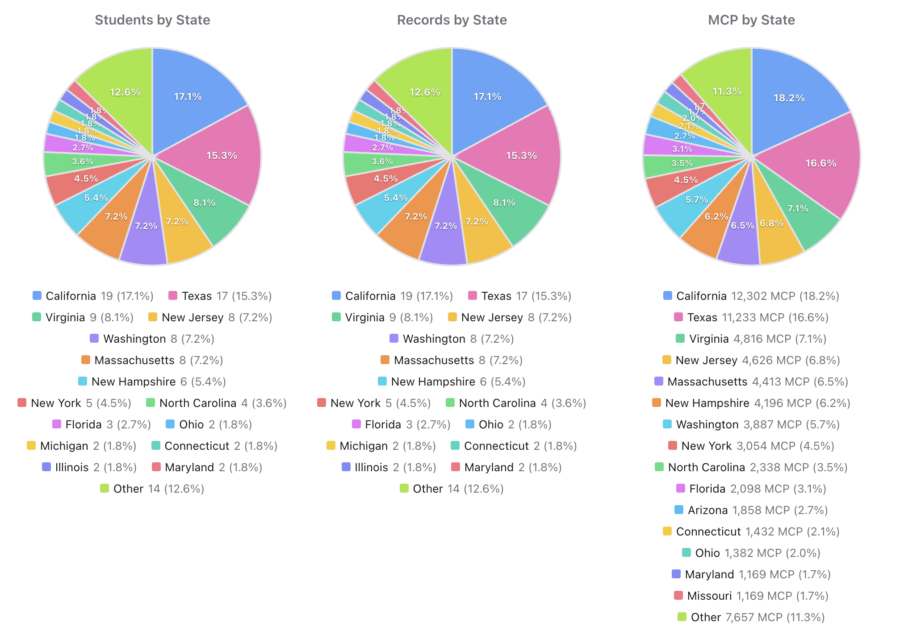
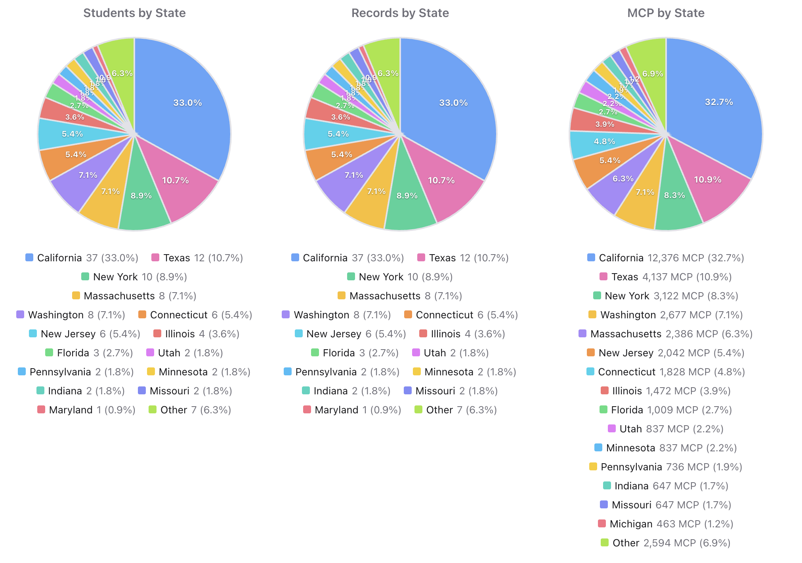

# USAMO and USAJMO 2026 Results Analysis

This article extracts practical insights from the newly published USAMO and USAJMO 2026 results and shows how to reproduce the same views on MathIntegrity.org.

MathIntegrity mirrors official MAA-published winner lists into a searchable dataset, so coaches, students, and parents can quickly analyze state and gender patterns.

In this article, we use three concrete examples to demonstrate the workflow:

1. Which states provide the most USAMO and USAJMO students  
2. Gender distribution among USAMO students  
3. Gender distribution among USAJMO students

It also includes a step-by-step workflow for using MathIntegrity.org to view distributions and inspect student trajectories.

For score-distribution context and historical perspective, see Evan Chen’s write-up: [USAMO statistics](https://web.evanchen.cc/exams/posted-usamo-statistics.pdf).

---

## Data Source and Important Disclaimer

- Official upstream source: MAA Student Awards page for USA(J)MO winners ([MAA Youth Program Awards Winners](https://maa.org/student-programs/youth-program-awards-winners/)).
- MathIntegrity source tables (structured copy for search and analysis): `database/contests/amo/year=2026/results.csv` and `database/contests/jmo/year=2026/results.csv`.
- State counting method: state is taken from `database/students/students.csv` (joined by `student_id`), not from the contest CSV state field.
- Coverage limitation: this dataset contains published USA(J)MO awardees/winners, not the full competitor or qualifier pool.
- Gender source: `database/students/students.csv` (`gender` field).
- Gender values come from the student profile table and may be corrected over time as records are updated.

---

## Which States Provide the Most USAMO and USAJMO Students?

### USAMO 2026 (n = 120)

Top contributors:

- California: 19
- Texas: 17
- Virginia: 9
- New Jersey: 8
- Massachusetts: 8
- Washington: 8

Other notable contributors include Ontario (Canada), New Hampshire, and New York.

### USAJMO 2026 (n = 112)

Top contributors:

- California: 37
- Texas: 12
- New York: 10
- Washington: 8
- Massachusetts: 8
- Connecticut: 6
- New Jersey: 6

### State-level takeaway

California is the largest contributor to both contests and is especially dominant in USAJMO 2026. Texas is a clear second in both contests. The top state mix is broadly similar between USAMO and USAJMO, but California’s share is much larger at the JMO level.

---

## USAMO 2026 Gender Distribution

USAMO gender breakdown:

- Male: 115
- Female: 5

If we only look at students with known gender (120 students):

- Male: 95.8%
- Female: 4.2%

### USAMO takeaway

USAMO 2026 is heavily male in the published awardee list.

---

## USAJMO 2026 Gender Distribution

USAJMO gender breakdown:

- Male: 90
- Female: 19

If we only look at students with known gender (112 students):

- Male: 83.0%
- Female: 17.0%

### USAJMO takeaway

USAJMO 2026 is still male-majority, but has a higher female share than USAMO in the published awardee list.

---

## How to Use MathIntegrity.org for This Analysis

Use this flow to reproduce the exact analysis in this article:

1. Open MathIntegrity.org and go to the main explorer page.
2. Use the competition filter to select `USAMO` or `USJMO`.
3. Use the year filter to select `2026`.
4. Open the `MCP` tab to view ranking/distribution summaries for the filtered data.
5. In the MCP view, switch between `By State` and `By Gender` to compare distributions.
6. Click individual students when needed to inspect full cross-contest records.

---

## Key Insights and Conclusions

1. **California leads both pipelines**, and is particularly dominant in USAJMO 2026 participation.
2. **Both contests are male-majority** in the published awardee lists, but USAJMO has a higher female share than USAMO.
3. Using MathIntegrity turns static winner lists into an interactive analysis workflow: state-level concentration, gender structure, and student-level trajectory can be checked in one place.
